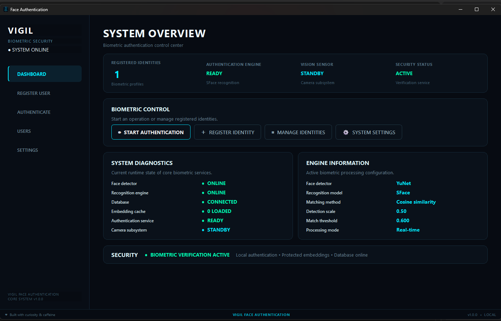
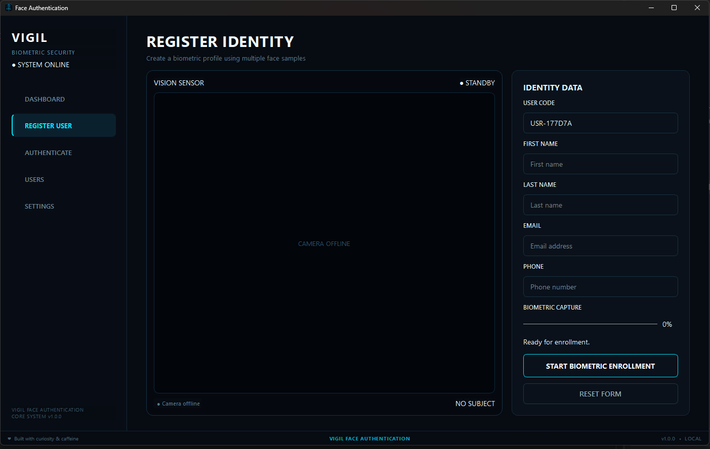
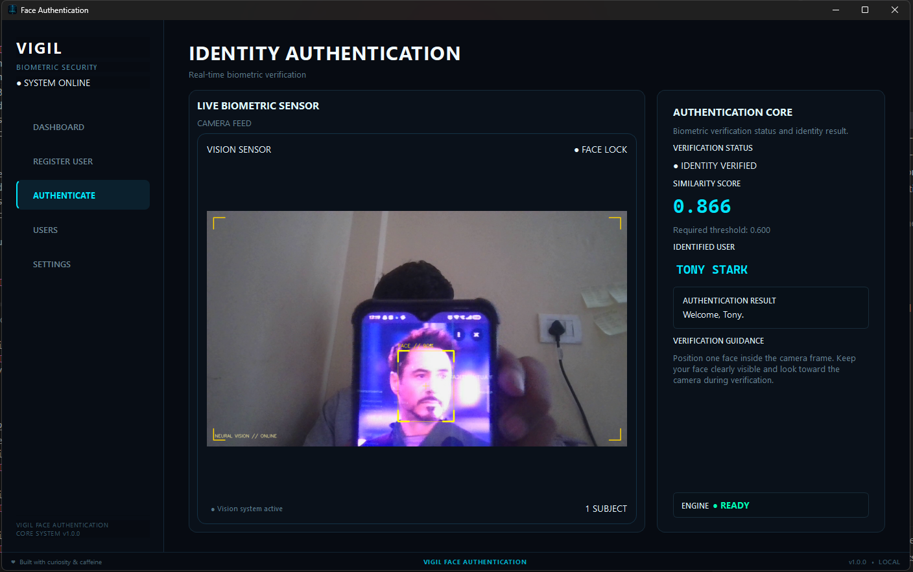
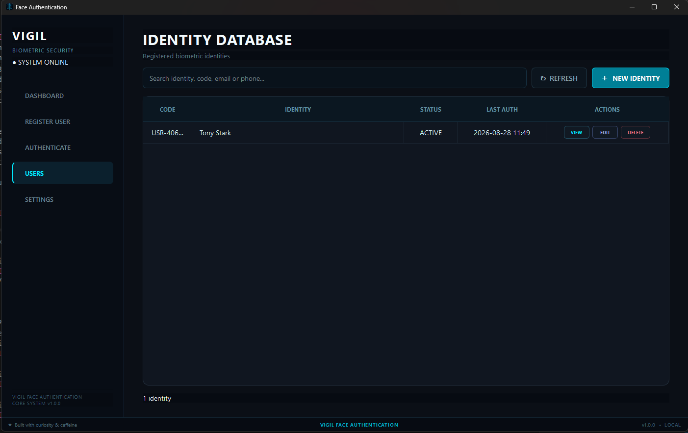
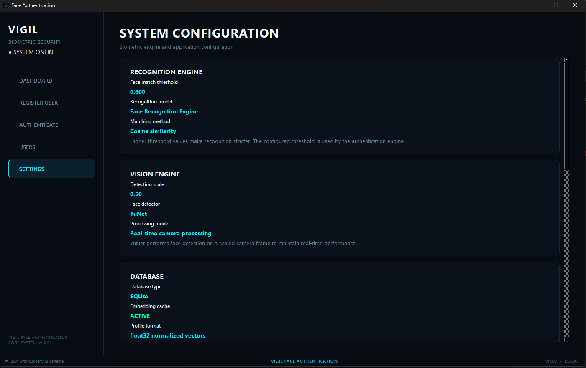

# VIGIL — Face Authentication System

A futuristic, local biometric authentication system built with **Python, PyQt6, OpenCV, YuNet, SFace, and SQLite**.

VIGIL provides real-time face detection, biometric enrollment, face recognition, identity management, and authentication through a modern desktop interface.

---

## Table of Contents

- [Features](#features)
- [How It Works](#how-it-works)
- [Technology Stack](#technology-stack)
- [Project Structure](#project-structure)
- [Requirements](#requirements)
- [Installation](#installation)
- [Running the Application](#running-the-application)
- [Biometric Data](#biometric-data)
- [Security & Privacy](#security--privacy)
- [Application Interface](#application-interface)
  - [Dashboard](#dashboard)
  - [Identity Registration](#identity-registration)
  - [Identity Authentication](#identity-authentication)
  - [Identity Management](#identity-management)
  - [System Settings](#system-settings)
- [Windows Executable](#windows-executable)
- [Configuration](#configuration)
- [Development](#development)
- [Project Status](#project-status)
- [Author](#author)
- [License](#license)

## Features

- 🔐 **Biometric Face Authentication**
  - Real-time face verification using SFace embeddings.
  - Cosine similarity based identity matching.
  - Authentication status and similarity score displayed in real time.
- 👤 **Identity Management**
  - Register new biometric identities.
  - Automatically generated unique user codes.
  - View, edit, and delete identities.
  - Search registered users.
  - View detailed user information.
- 📸 **Biometric Enrollment**
  - Captures multiple face samples through the camera.
  - Requires exactly one visible face during enrollment.
  - Generates biometric embeddings from captured samples.
  - Stores biometric profiles locally.
- 👁️ **Face Detection**
  - Uses the **YuNet** face detector.
  - Optimized for real-time camera processing.
- 🧠 **Face Recognition**
  - Uses the **SFace** recognition model.
  - Pre-trained recognition model — user registration does **not retrain the model**.
  - Face images are processed to generate biometric embeddings.
- 📊 **System Dashboard**
  - Registered identity count, engine status, camera status, security status, runtime diagnostics, engine configuration, and quick-access controls.
- ⚙️ **System Settings**
  - Recognition threshold, detection scale, engine/database information, embedding cache, system status, application information, developer information, and maintenance tools.
- 🖥️ **Modern Desktop UI**
  - Built with PyQt6.
  - Dark futuristic interface with neon cyan biometric/security styling.
  - Console-inspired typography.

## How It Works

VIGIL uses a pre-trained face detection and recognition pipeline.

```text
                  CAMERA
                     │
                     ▼
              ┌─────────────┐
              │    YuNet    │
              │ Face Detect │
              └──────┬──────┘
                     │
                     ▼
               Detected Face
                     │
                     ▼
              ┌─────────────┐
              │    SFace    │
              │ Recognition │
              └──────┬──────┘
                     │
                     ▼
              Face Embedding
                     │
          ┌──────────┴──────────┐
          │                     │
       ENROLLMENT          AUTHENTICATION
          │                     │
          ▼                     ▼
   Store Embedding       Compare Embeddings
                                │
                                ▼
                       Cosine Similarity
                                │
                         ┌──────┴──────┐
                         ▼             ▼
                       MATCH        NO MATCH
                         │             │
                         ▼             ▼
                     VERIFIED       UNKNOWN
```

### Enrollment

```text
Camera
  ↓
Multiple face samples
  ↓
Face detection
  ↓
SFace embedding generation
  ↓
Biometric profile
  ↓
SQLite database
  ↓
Embedding cache
```

The application **does not train the SFace model for every new user**. It generates a biometric representation of the user's face and stores that representation.

### Authentication

```text
Live camera frame
       ↓
Face detection
       ↓
Face embedding
       ↓
Compare with registered embeddings
       ↓
Cosine similarity
       ↓
Threshold evaluation
       ↓
Identity verified / rejected
```

## Technology Stack

| Component | Technology |
|---|---|
| Language | Python |
| GUI | PyQt6 |
| Computer Vision | OpenCV |
| Face Detection | YuNet |
| Face Recognition | SFace |
| Database | SQLite |
| Biometric Representation | Float32 normalized embeddings |
| Matching | Cosine similarity |
| Environment | `uv` |
| Packaging | PyInstaller |

## Project Structure

```text
Face-Authentication/
│
├── app/
│   ├── assets/
│   │   ├── icon.ico
│   │   └── icon.png
│   ├── database/
│   ├── face/
│   ├── schemas/
│   ├── services/
│   ├── ui/
│   ├── config.py
│   └── __main__.py
│
├── data/
│   ├── face_detection_yunet_2023mar.onnx
│   └── face_recognition_sface_2021dec.onnx
│
├── docs/
│   └── images/
│       ├── dashboard.png
│       ├── registration.png
│       ├── authentication.png
│       ├── users.png
│       └── settings.png
│
├── tests/
├── .env.example
├── .gitignore
├── main.py
├── pyproject.toml
├── uv.lock
└── README.md
```

> The internal project structure may evolve as VIGIL continues to develop.

## Requirements

- Windows 10/11
- Python 3.13
- Webcam
- Dependencies defined in `pyproject.toml`
- YuNet and SFace `.onnx` model files

## Installation

Clone the repository:

```bash
git clone https://github.com/shreekanthkapparagaon/vigil-face-authentication.git
cd vigil-face-authentication
```

Sync the project environment using `uv`:

```bash
uv sync
```

Make sure the required ONNX models are available inside:

```text
data/
```

## Running the Application

```bash
uv run python -m app
```

## Biometric Data

VIGIL is designed as a **local biometric authentication system**.

During enrollment, camera frames are temporarily processed to generate biometric embeddings. The recognition process is based on numerical face embeddings rather than continuously training a model.

The local system uses:

```text
SQLite
   +
Biometric Embeddings
   +
Local Embedding Cache
```

The local database and runtime biometric data are intentionally excluded from Git through `.gitignore`.

The required `.onnx` detection and recognition models are stored in the `data/` directory and are required at runtime.

## Security & Privacy

VIGIL is designed around local processing.

- Face recognition is performed locally.
- Authentication data is stored locally.
- No cloud authentication service is required.
- Database files are excluded from source control.
- Runtime biometric data should never be committed to Git.
- Required model files are kept separately from generated biometric data.

**Important:** Biometric embeddings are sensitive data. Protect the application's database and runtime data directory appropriately when deploying the system.

## Application Interface

VIGIL provides a clean desktop interface for biometric registration, real-time authentication, identity management, and system monitoring.

### Dashboard

The dashboard provides a real-time overview of the VIGIL authentication system, including registered identities, engine status, diagnostics, configuration information, security status, and quick actions.



```text
SYSTEM OVERVIEW

├── System Summary
│   ├── Registered Identities
│   ├── Authentication Engine
│   ├── Vision Sensor
│   └── Security Status
│
├── Biometric Control
│   ├── Start Authentication
│   ├── Register Identity
│   ├── Manage Identities
│   └── System Settings
│
├── System Diagnostics
│   ├── Face Detector
│   ├── Recognition Engine
│   ├── Database
│   ├── Embedding Cache
│   ├── Authentication Service
│   └── Camera Subsystem
│
├── Engine Information
│   ├── Face Detector
│   ├── Recognition Model
│   ├── Matching Method
│   ├── Detection Scale
│   ├── Match Threshold
│   └── Processing Mode
│
└── Security Status
    └── Biometric Verification
```

### Identity Registration

The registration interface captures multiple face samples from the live camera and creates a biometric profile for the identity.



```text
REGISTER IDENTITY

├── Camera
│   └── Live Face Detection
│
├── Identity Data
│   ├── User Code
│   ├── First Name
│   ├── Last Name
│   ├── Email
│   └── Phone
│
├── Biometric Capture
│   ├── Sample Collection
│   ├── Enrollment Progress
│   └── Capture Status
│
└── Registration Controls
    ├── Start Biometric Enrollment
    └── Reset Form
```

### Identity Authentication

The authentication interface performs real-time biometric verification using the live camera feed and registered face embeddings.



```text
IDENTITY AUTHENTICATION

├── Live Camera
│   └── Face Detection
│
├── Authentication Core
│   ├── Authentication Status
│   ├── Similarity Score
│   ├── Matched Identity
│   └── Authentication Message
│
└── Verification States
    ├── Waiting for Face
    ├── Identity Verified
    └── Access Not Verified
```

### Identity Management

The Users interface provides a centralized view of registered biometric identities with search and management operations.



```text
IDENTITY DATABASE

├── Search
│   └── Identity / Code / Email / Phone
│
├── Identity List
│   ├── Code
│   ├── Identity
│   ├── Status
│   └── Last Authentication
│
└── Identity Actions
    ├── View
    ├── Edit
    └── Delete
```

### System Settings

The settings interface provides information about the biometric engine, vision system, database, runtime status, application, and maintenance.



```text
SYSTEM CONFIGURATION

├── Recognition Engine
│   ├── Face Match Threshold
│   ├── Recognition Model
│   └── Matching Method
│
├── Vision Engine
│   ├── Detection Scale
│   ├── Face Detector
│   └── Processing Mode
│
├── Database
│   ├── Database Type
│   ├── Embedding Cache
│   ├── Profile Format
│   └── Loaded Profiles
│
├── System Status
│   ├── Application
│   ├── Authentication Engine
│   ├── Database
│   └── Camera
│
├── Application Information
│   ├── Application Name
│   ├── Version
│   ├── Build
│   └── Environment
│
├── Developer Information
│   ├── Developer
│   ├── Project
│   ├── Technology
│   └── Architecture
│
└── Maintenance
    └── Refresh Embedding Cache
```

## Windows Executable

VIGIL can be packaged as a Windows executable using **PyInstaller**.

Application icon:

```text
app/assets/icon.ico
```

Application artwork:

```text
app/assets/icon.png
```

When packaging the application, the ONNX models and required assets must also be included in the final build.

## Configuration

Important biometric configuration values include:

```text
Face match threshold
Face detection scale
```

These values control the recognition and detection pipeline and are displayed in the **Settings** section.

## Development

Run the application:

```bash
uv run python -m app
```

Run tests:

```bash
uv run pytest
```

---


## Project Status

**Version:** `1.0.0`  
**Status:** Active Development

VIGIL is being developed as a local desktop biometric authentication platform.

---

## Author

**Shreekanth Kapparagaon**

VIGIL Face Authentication System

Built with Python, PyQt6, OpenCV, YuNet, SFace, and SQLite.

---

## License

This project is licensed under the **MIT License**.

See the [LICENSE](LICENSE) file for details.
